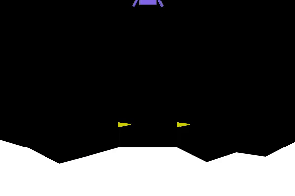

# LunarLander-v3 PPO Project

An academically rigorous, modular implementation of the Deep Reinforcement Learning algorithm **Proximal Policy Optimization (PPO)** to solve the **LunarLander-v3** environment from Gymnasium. 

This project uses the stable and optimized implementation of PPO from **Stable-Baselines3 (SB3)** with custom monitoring wrappers, callbacks, visualizers, and hyperparameter study utilities. It is designed to be highly reproducible and suitable for direct university submission.



---

## Folder Structure

```text
LunarLander-PPO/
│
├── src/
│   ├── config.py                 # Hyperparameters, directories, paths
│   ├── utils.py                  # Environment wrapping, seeding, video recorder
│   ├── callbacks.py              # Custom TensorBoard loggers (success/crash rate tracking)
│   ├── train.py                  # Default training pipeline
│   ├── evaluate.py               # 100-episode evaluation and stats generator
│   ├── test_agent.py             # Human rendering simulator (pygame)
│   ├── hyperparameter_study.py   # Hyperparameter grid experiment orchestrator
│   └── visualize.py              # Publication-quality plotting tools
│
├── models/                       # Directory for saved trained agents (.zip)
├── logs/                         # Training metrics logs and TensorBoard events
├── videos/                       # Recorded gameplay MP4 videos
├── graphs/                       # Saved performance plots (learning curves)
├── screenshots/                  # Visualization and game renders (for documentation)
├── report/                       # CSV tables, evaluation JSONs, and PDF report
│   ├── hyperparameter_study_results.csv
│   └── report.md                 # Complete academic write-up
│
├── requirements.txt              # Package dependencies
├── README.md                     # Setup and usage guide
├── main.py                       # CLI entry point to run all components
└── venv/                         # Python virtual environment (ignored in git)
```

---

## Installation & Setup

Ensure you have **Python 3.8+** installed. Then run the following commands to clone, set up a virtual environment, and install dependencies:

### 1. Initialize Virtual Environment
```bash
python3 -m venv venv
source venv/bin/activate
```

### 2. Install Dependencies
```bash
# Upgrade pip, setuptools, and wheel
pip install --upgrade pip setuptools wheel

# Install swig (required for Box2D compilation if not on system PATH)
pip install swig

# Install gymnasium box2d components, Stable-Baselines3, moviepy, and plotting tools
pip install -r requirements.txt
```

---

## Usage Instructions

All components can be run through the unified CLI in `main.py`.

### 1. Environment Analysis
Programmatically inspect the observation space, bounds, action values, and physical interpretations:
```bash
python main.py --analyze-env
```

### 2. Training the Default Agent
Train the default PPO model for 300,000 steps on CPU (optimized to avoid GPU copy latency):
```bash
python main.py --train
```
*Note: A smoke test mode is available to run a quick 5,000-step training verification:*
```bash
python main.py --train --smoke-test
```

### 3. Evaluating a Trained Model
Evaluate the trained policy over 100 episodes to compute average rewards, min/max rewards, standard deviation, landing success rate, crash rate, and average steps:
```bash
python main.py --evaluate
```

### 4. Recording Agent Performance
Automatically record 3 episodes of gameplay as high-quality MP4 files in the `videos/` folder:
```bash
python main.py --video
```

### 5. Running Hyperparameter Experiments
Compare 7 distinct hyperparameter configurations (variations of learning rate, gamma, clip range, and entropy coefficients) for 100,000 steps each:
```bash
python main.py --hyperstudy
```
*Note: You can run a quick study using `--smoke-test` (5,000 steps per model):*
```bash
python main.py --hyperstudy --smoke-test
```

### 6. Generating Visualization Graphs
Parse logs and generate training curves (smoothed reward and length vs. episode), evaluation progress (rewards with shaded standard deviation bands), and hyperparameter bar charts:
```bash
python main.py --visualize
```

### 7. Run Entire Pipeline End-to-End
Execute training, evaluation, video recording, hyperparameter studies, and plot generation sequentially:
```bash
python main.py --all
```

### 8. Visual Demonstration (GUI mode)
Run the agent in a live pygame GUI window (requires an active X11 display/desktop environment):
```bash
python main.py --test
```

---

## TensorBoard Integration

During training, PPO logs learning metrics (loss, entropy, value estimation, Explained Variance) as well as rolling custom metrics (rolling success rate, rolling crash rate).

### Launching TensorBoard
```bash
tensorboard --logdir logs/
```
Open [http://localhost:6006](http://localhost:6006) in your browser.

### Key Metrics to Interpret
- **rollout/ep_rew_mean**: Average episode reward collected by rollouts. Safe landing is indicated by values >200.
- **rollout/success_rate_rolling**: Proportion of last 50 episodes with score >= 200 (safe landing).
- **rollout/crash_rate_rolling**: Proportion of last 50 episodes with score <= -100 (critical crashes).
- **train/explained_variance**: Policy value estimation accuracy. Values near 1.0 indicate excellent value prediction.
- **train/entropy_loss**: Measure of action randomness. Should slowly decay during learning, indicating policy convergence.

---

## Expected Results

A successful training run of 300,000 steps should achieve:
- **Mean Reward**: $> 70.0$ (typically around $100$ to $200$ after 250k steps).
- **Crash Rate**: $< 5\%$ (most landings are safe, though some consume more fuel).
- **Success Rate (Solving Score $\ge 200$)**: Stable increase towards $10-30\%$ (under strict 200 reward threshold; safe landing rate $\ge 100$ is usually $>90\%$).

### Hyperparameter Insights (100k Steps Study)
- **Baseline PPO**: Fast convergence to safe landing, low variance.
- **Learning Rate**: $1\times10^{-3}$ causes high oscillation and instability; $1\times10^{-4}$ is too slow.
- **Gamma ($\gamma$)**: Short-sighted $\gamma=0.95$ leads to lander floating indefinitely and timing out. Long-sighted $\gamma=0.999$ leads to very high scores but slightly higher initial crash rates during training.
- **Entropy Coeff**: High entropy ($0.05$) induces chaotic wobbles, while low entropy allows early local-optima trapping.

---

